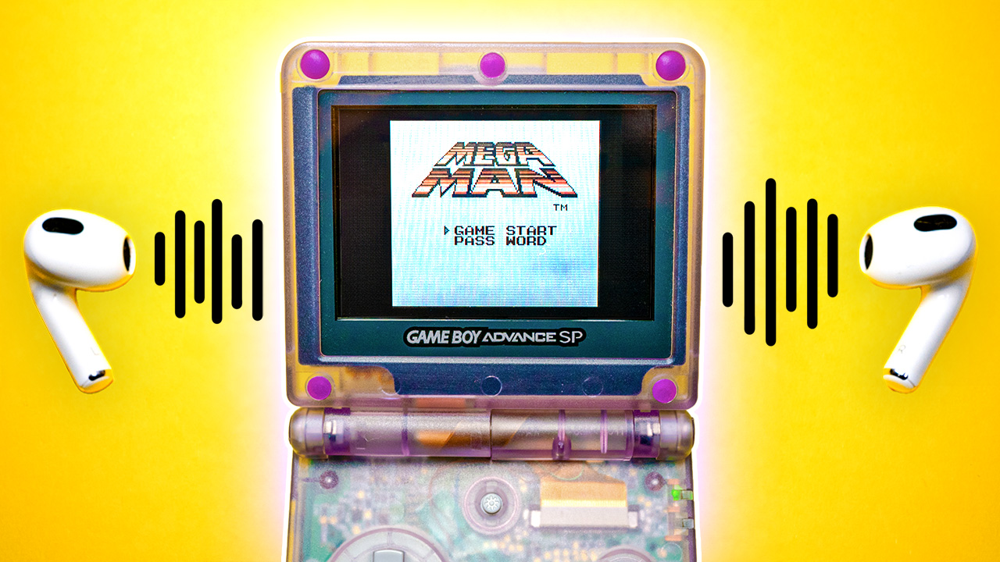
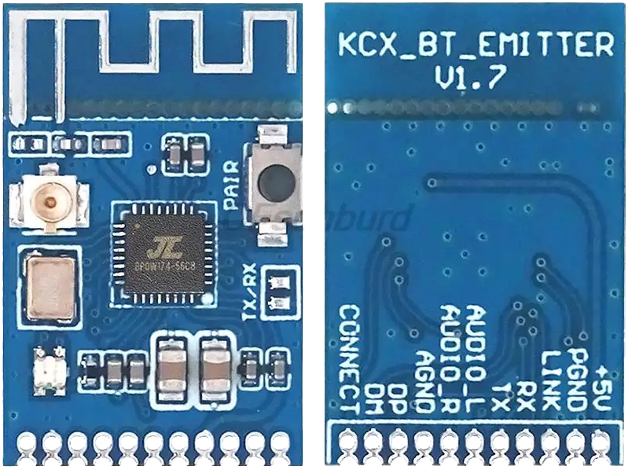
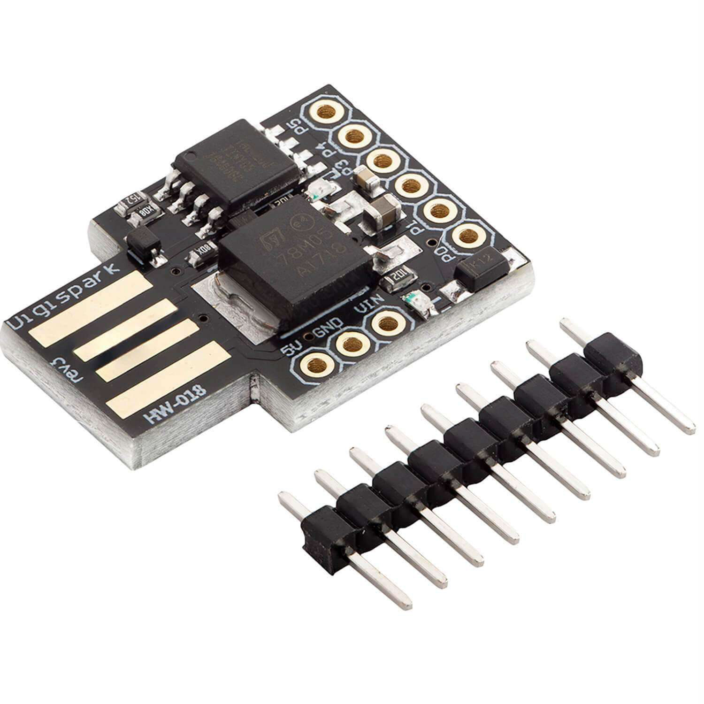
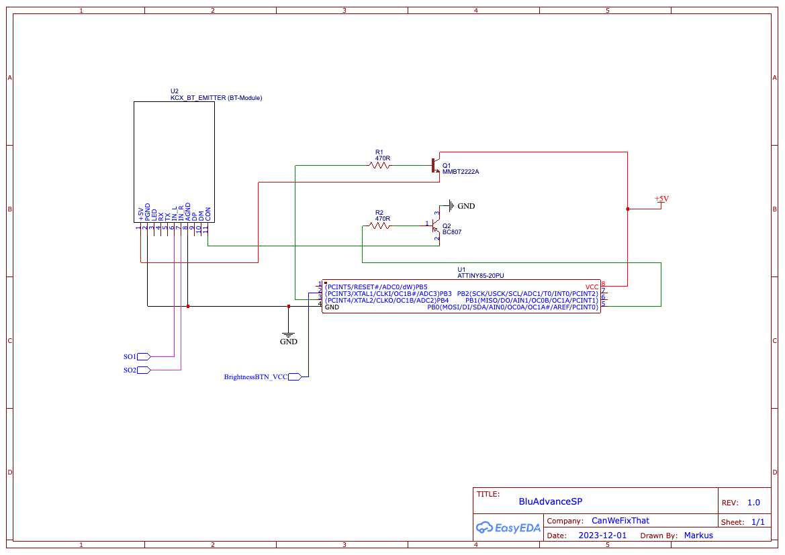
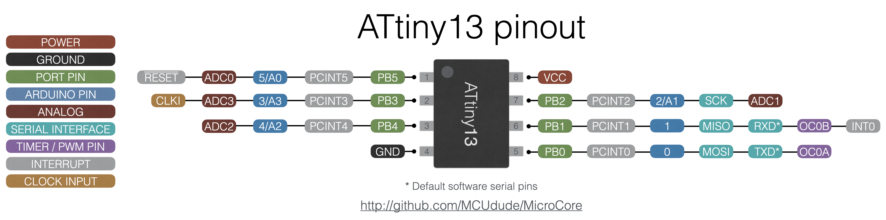
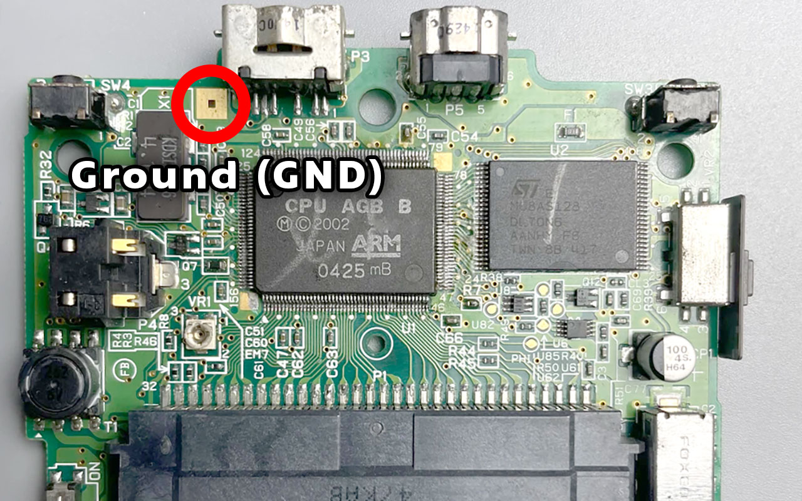
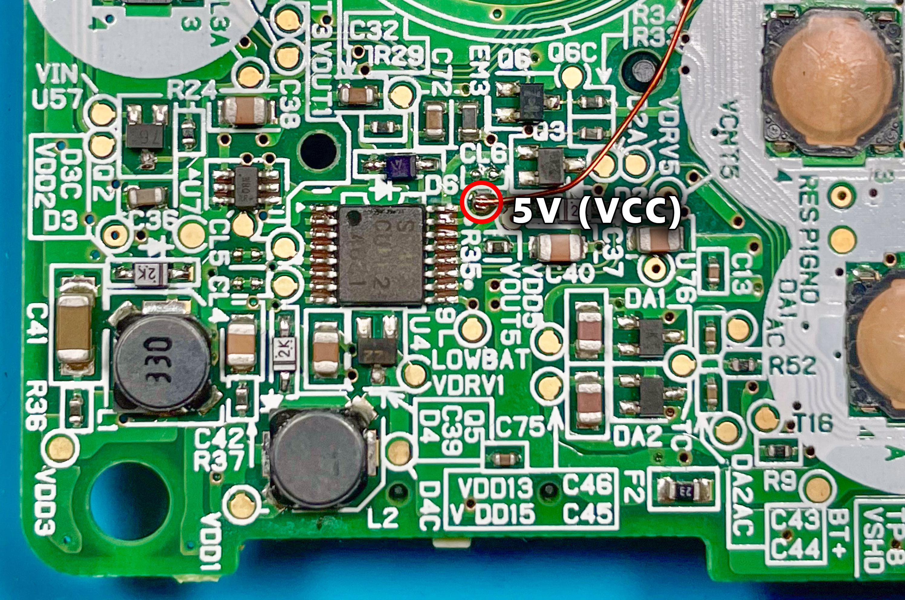
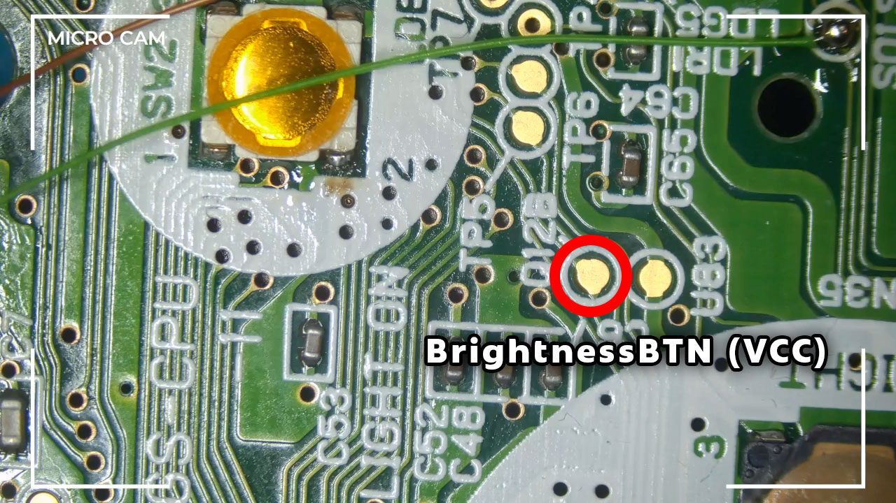
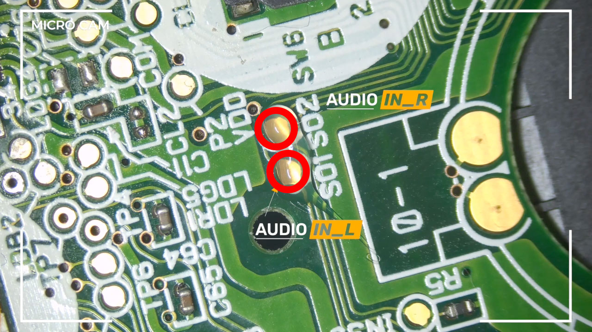

# BluAdvanceSP

BluAdvanceSP is a project that allows you to mod your **GameBoy Advance SP** with *Bluetooth* in **stereo quality.** 

To make this happen, we use a commonly used Bluetooth transmitter module called **KCX_ BT_ EMITTER**. 

We could use it solo and call it a day. This would be kinda boring, and I wanted to have something more sophisticated. When we connect it directly to the *GBA SP*, it will drain unnecessary its battery, even when we won't use it.

To get around this problem, we could modify the case and add an extra switch to turn the module off; it's not ideal, but it's a solution. The next issue would be the pairing process itself; a second button would be needed, or you could connect it, for example, to the *select* button of the GameBoy. But this would mean every time you press this button, it will start the pairing process of the module - not very smart!

That's why I was thinking about another solution: **A microcontroller!**

I used an **ATTiny85** from *Atmel* to control the Bluetooth module smartly.
This tiny little masterpiece allows us to extend the functionality of the brightness control button of the *GBA SP*.

We don't sacrifice any functionality of the button itself; it can still be used to turn *on/off* the background light of the screen. But furthermore, we can power *on/off* the Bluetooth module and activate its *pairing* process if needed.

## ✨ Features

- Remembers the power state on/off
- *Fully controllable* with the *GBA SP brightness button*
    - **Long-Press:** Power on/off the Bluetooth module
    - **Double-Press:** Enter the Pairing-Mode of the Bluetooth module

## 🍿 YouTube

**You can see the whole journey, including a demo of this mod in this video:**

**CanWeFixThat Channel**

I'm Markus, your tech repair and modding expert. Join me as I extend the lifespan of consumer tech and reduce waste. With step-by-step videos and tips, I'll fix, upgrade, and repurpose your devices. Stay tuned for the latest in tech repair and modding.
https://www.youtube.com/@CanWeFixThat

## 📦 Components

To replicate this work, you need the following components:

### Bluetooth module
* **1x** KCX_ BT_ EMITTER (v1.7; tested)

### Microcontroller
* **1x** Digispark USB Development Board (ATTiny85)
    * includes the SMD Version of the ATTiny85 and can later be desoldered after programming

### Resistors
The resistors are needed to connect the transistors properly to the microcontroller.
* **2x** 470 Ohm (1206;SMD)

### Transistors
The transistors power on/off the Bluetooth module (*BC807*) and bring it into pairing mode (*MMBT2222A*).

* **1x** MMBT2222A (NPN)
* **1x** BC807 (PNP)

### Wires
The easiest way to wire up this mod is to use color-coded wires that are not too thick.
* ~ 36AWG Wires

## 🚀 Installation

> [!CAUTION]
> Everything you do is at your own risk; I am not responsible for any damage due to wrong documentation or other circumstances; please keep that in mind.

### Upload Sketch

I used *Visual Studio Code* with *PlatformIO*. https://docs.platformio.org/en/stable/integration/ide/vscode.html

Clone the repo and load it into *Visual Studio Code*. When you use the *Digispark USB Development Board*, you should be fine uploading the project to it; if not, you need to change or modify the *platformio.ini* accordingly to your programmer of choice.

### Wiring

When you successfully upload the Sketch to the ATTtiny85, you can test the setup. 

#### Schematic
> [!NOTE]
> This schematic shows how to wire the components.

#### Digispark Pinout
> [!NOTE]
> This shows the *Digispark Developer Board* pinout, making it easier to work with the *ATTiny85* for testing and programming.
> by [MortenAaserud](https://www.deviantart.com/mortenaaserud/gallery)

#### ATTiny85 Pinout
> [!NOTE]
> This shows the *ATTiny85*
> by [MCUdude](https://github.com/MCUdude)

#### GameBoy Advance SP Ground (GND)
> [!NOTE]
> I used this GND pad for grounding.

#### GameBoy Advance SP 5V (VCC)
> [!NOTE]
> For a stable 5V power supply, I used this test point.

#### Brightness Button Connection
> [!NOTE]
> This is the pad you need for the button connection.

#### Left and Right Audio Connection
> [!NOTE]
> These are both pads for the left and right audio.

## ☝🏻 Usage

The usage is straightforward. The system supports two main functions:

### Power On/Off
You can power the module on or off with a **long press** of the *GBA SP brightness button*.

### Pairing
To connect or reconnect a Bluetooth device, you must **double press** the *GBA SP brightness button*.

### Memory
The system saves with every **long press** the current power state to the microcontroller, and after power cycling your GameBoy, the Bluetooth module is switched on or off accordingly.

## 🌍 License

Creative Commons License
This work is licensed under a Creative Commons Attribution-ShareAlike 4.0 International License. You can copy and redistribute the material in any medium or format, as well as remix, transform, or build upon the material for any purpose (even commercial) - but you must give appropriate credit, provide a link to the license, and indicate if any changes were made.

© CanWeFixThat 2024
